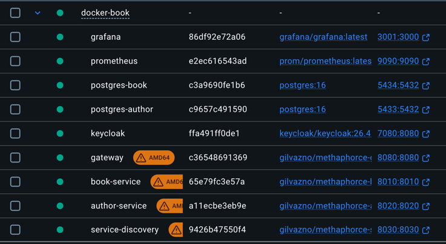
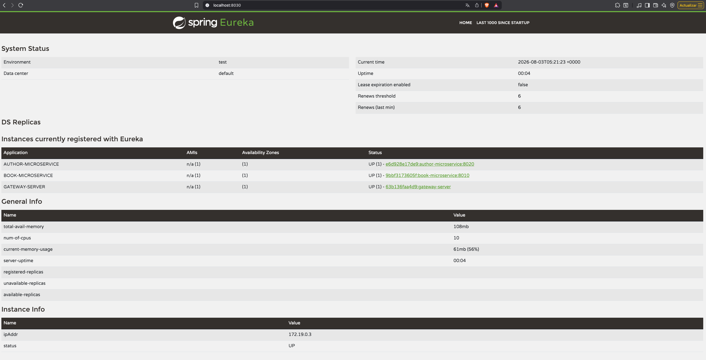
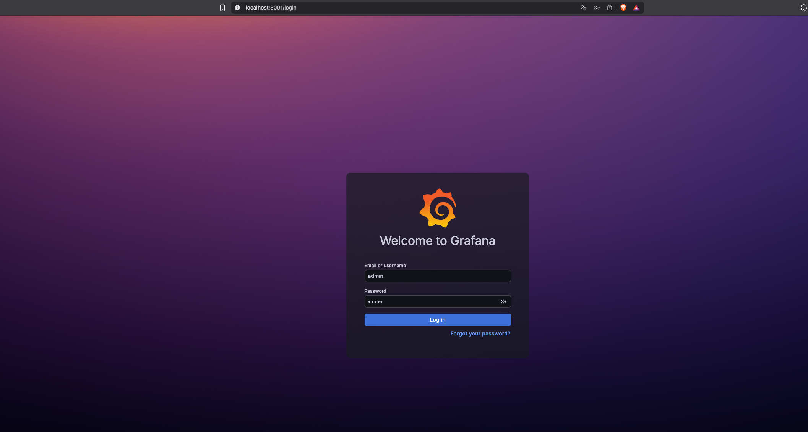
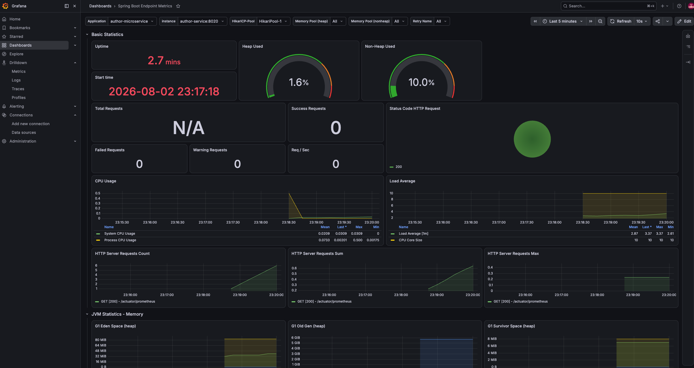
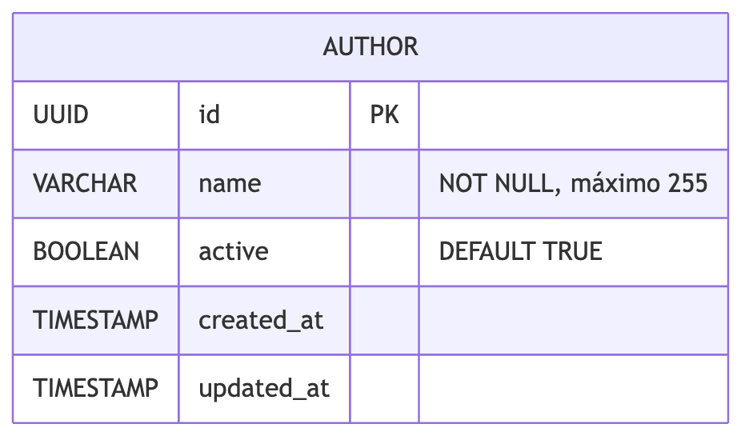
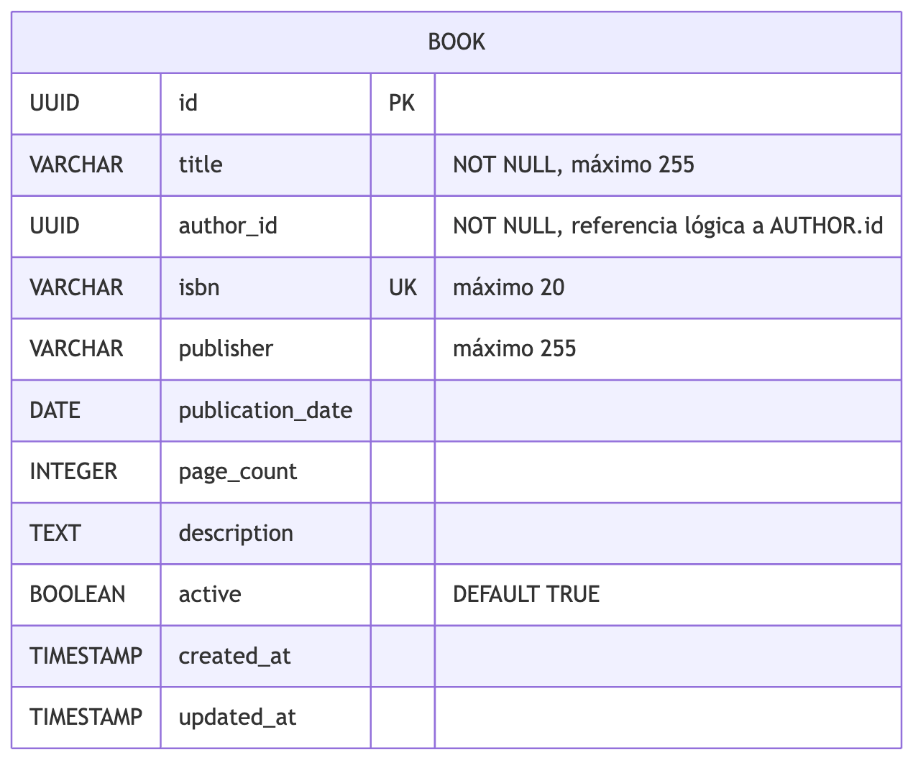

## 👨‍💻 Acerca de mí

Soy **Gilberto Vázquez Noriega**, Ingeniero en Sistemas Computacionales, actualmente me estoy capacitando para ser un desarrollador backend especializado en Java. Me apasiona construir soluciones robustas, escalables y mantenibles, aplicando buenas prácticas de desarrollo y arquitectura de software.

Me mantengo en aprendizaje continuo, siempre explorando nuevas tecnologías y fortaleciendo mis habilidades para mejorar como profesional y aportar mayor valor en cada proyecto.

<a href="https://www.linkedin.com/in/gilvn/" target="_blank">
  
</a>


# 📚 Book Dictionary System

Es un sistema de gestión de libros construido bajo una **arquitectura de microservicios**, diseñado para ser escalable, desacoplado y alineado a buenas prácticas modernas.

---
# ⚙️ Tecnologías usadas
| Tecnología                                   | Uso en el proyecto                                                      |
|----------------------------------------------|-------------------------------------------------------------------------|
| **Java 21**                                  | Lenguaje y runtime de todos los servicios.                              |
| **Spring Boot 3.5.13**                       | Creación, configuración y ejecución de las aplicaciones.                |
| **Spring Cloud Gateway**                     | Punto de entrada único y enrutamiento hacia los microservicios.         |
| **Netflix Eureka**                           | Registro, descubrimiento y resolución de instancias de servicios.       |
| **Spring Cloud OpenFeign**                   | Comunicación HTTP entre `book-service` y `author-service`.              |
| **Resilience4j**                             | Circuit Breaker, reintentos y tolerancia a fallos en llamadas remotas.  |
| **Spring Security + OAuth2 Resource Server** | Autenticación de peticiones mediante tokens JWT.                        |
| **Keycloak 26.4.7**                          | Emisión de tokens, clientes y cuentas de servicio.                      |
| **Spring Data JPA + Hibernate**              | Persistencia, repositorios y mapeo objeto-relacional.                   |
| **PostgreSQL 16**                            | Base de datos independiente para libros y autores.                      |
| **Spring Boot Actuator**                     | Endpoints de salud, información, métricas y estado del Circuit Breaker. |
| **Maven**                                    | Manejo del ciclo de vida de los microservicios.                         |
| **Google Jib**                               | Permite compilar y publicar imagenes en Docker Hub sin Dockerfile.                                                                     

# 🏗️ Arquitectura del sistema
El sistema utiliza una arquitectura de microservicios con un punto de entrada único, descubrimiento dinámico de servicios, autenticación centralizada, una base de datos por servicio y una capa de observabilidad basada en Prometheus y Grafana.

| Componente | Responsabilidad                                                                                  |
|---|--------------------------------------------------------------------------------------------------|
| API cliente | Solicita un token a Keycloak y consume los recursos a través del Gateway.                        |
| Keycloak | Gestiona los usuarios, clientes, cuentas de servicio y emisión de tokens JWT.                    |
| API Gateway | Punto de entrada único y enrutamiento hacia los microservicios.                                  |
| Eureka Server | Registro y descubrimiento dinámico de instancias.                                                |
| Book Service | Gestión de libros y comunicación con Author Service mediante OpenFeign, Circuit Breaker y Retry. |
| Author Service | Gestión y consulta de autores.                                                                   |
| Book DB | Base PostgreSQL exclusiva de Book Service.                                                       |
| Author DB | Base PostgreSQL exclusiva de Author Service.                                                     |
| Prometheus | Recolecta y almacena las métricas expuestas en `/actuator/prometheus`.                           |
| Grafana | Consulta Prometheus y presenta dashboards, métricas y alertas.                                   |


## 🔹 Diagrama lógico


# 🚀 Levantar los microservicios

## 🔹 Requisitos previos

- Docker Desktop o Docker Engine con Docker Compose.
- Git.
- Postman para ejecutar la colección de pruebas.
- Los puertos `3001`, `5433`, `5434`, `7080`, `8010`, `8020`, `8030`, `8080` y `9090` deben estar disponibles.

## 🔹 Iniciar el sistema

1. Clona el repositorio y entra en su directorio:

   ```bash
   git clone https://github.com/gilNon/book-dictionary-microsystems.git
   cd book-dictionary-microsystems
   ```

2. Levanta todos los componentes con Docker Compose:

   ```bash
   docker-compose -f docker-book/docker-compose.yml up -d
   ```

   En el primer arranque, Docker descargará las imágenes e inicializará las bases de datos con los scripts de `docker-book/init`.

3. Comprueba que los contenedores estén ejecutándose y saludables:

   ```bash
   docker-compose -f docker-book/docker-compose.yml ps
   ```

   

4. Si algún contenedor no inicia correctamente, revisa sus logs:

   ```bash
   docker-compose -f docker-book/docker-compose.yml logs -f <NOMBRE_DEL_SERVICIO>
   ```

## 🔹 Verificar Eureka

Abre [http://localhost:8030](http://localhost:8030) y confirma que `AUTHOR-MICROSERVICE`, `BOOK-MICROSERVICE` y `GATEWAY-SERVER` aparezcan registrados.



## 🔹 Verificar Grafana

Abre [http://localhost:3001](http://localhost:3001) e inicia sesión con las credenciales predeterminadas:

- **Usuario:** `admin`
- **Contraseña:** `admin`

Estas credenciales se pueden cambiar mediante las variables `GRAFANA_ADMIN_USER` y `GRAFANA_ADMIN_PASSWORD` antes de iniciar Docker Compose.



Grafana incluye a Prometheus como fuente de datos para consultar las métricas expuestas por los microservicios.



## 🔹 Importar la colección de Postman

1. Abre Postman y selecciona **Import**.
2. Importa el archivo `postman/BOOK DICTIONARY.postman_collection.json` incluido en el repositorio.
3. Ejecuta primero la petición **AUTH > GET TOKEN** para obtener un `access_token` de Keycloak.
4. Copia el valor de `access_token` sin comillas.
5. En las peticiones de las carpetas **BOOK** y **AUTHOR**, abre **Authorization**, selecciona **Bearer Token** y reemplaza el token guardado por el nuevo.
6. Ejecuta las peticiones contra el Gateway en `http://localhost:8080`.

> Los tokens incluidos en una colección exportada pueden haber expirado. Genera uno nuevo antes de probar los endpoints protegidos.

## 🔹 Detener el sistema

```bash
docker compose -f docker-book/docker-compose.yml down
```

# 📡 API Design

## 🔹 Base URL

- **API Gateway:** `http://localhost:8080`
- **Keycloak:** `http://localhost:7080`

> Los endpoints de Books y Authors requieren el encabezado `Authorization: Bearer <access_token>`.

## 🔐 Auth

| Método y endpoint | Descripción | Ejemplo JSON request | Ejemplo JSON response |
|---|---|---|---|
| `POST http://localhost:7080/realms/books/protocol/openid-connect/token` | Obtiene un token de Keycloak mediante Client Credentials. Enviar como `application/x-www-form-urlencoded`. | <pre><code>{&#10;  "grant_type": "client_credentials",&#10;  "client_id": "book-api",&#10;  "client_secret": "&lt;CLIENT_SECRET&gt;"&#10;}</code></pre> | <pre><code>{&#10;  "access_token": "&lt;JWT&gt;",&#10;  "expires_in": 300,&#10;  "refresh_expires_in": 0,&#10;  "token_type": "Bearer",&#10;  "not-before-policy": 0,&#10;  "scope": "email profile"&#10;}</code></pre> |

## 📚 Books

| Método y endpoint | Descripción | Ejemplo JSON request | Ejemplo JSON response |
|---|---|---|---|
| `POST /book-microservice/api/v1/books` | Crea un libro. | <pre><code>{&#10;  "title": "Clean Code",&#10;  "authorId": "b602d62a-3aa2-5c24-9920-38848b1bf4d9",&#10;  "isbn": "978013235088690",&#10;  "publisher": "Prentice Hall",&#10;  "publicationDate": "2008-08-02",&#10;  "edition": "1st",&#10;  "pageCount": 464,&#10;  "description": "A handbook of agile software craftsmanship"&#10;}</code></pre> | <pre><code>{&#10;  "id": "34359d20-6fb6-5dea-98c4-f326217f8b93",&#10;  "title": "Clean Code",&#10;  "authorId": "b602d62a-3aa2-5c24-9920-38848b1bf4d9",&#10;  "isbn": "978013235088690",&#10;  "publisher": "Prentice Hall",&#10;  "publicationDate": "2008-08-02",&#10;  "pageCount": 464,&#10;  "description": "A handbook of agile software craftsmanship",&#10;  "createdAt": "2026-04-24T20:15:30Z",&#10;  "updatedAt": "2026-04-24T20:15:30Z"&#10;}</code></pre> |
| `GET /book-microservice/api/v1/books` | Obtiene libros paginados. Admite `page`, `size`, `authorId` y `title` como parámetros opcionales. | — | <pre><code>{&#10;  "data": [{&#10;    "id": "34359d20-6fb6-5dea-98c4-f326217f8b93",&#10;    "title": "Clean Code",&#10;    "authorId": "b602d62a-3aa2-5c24-9920-38848b1bf4d9",&#10;    "isbn": "978013235088690",&#10;    "publisher": "Prentice Hall",&#10;    "publicationDate": "2008-08-02",&#10;    "pageCount": 464,&#10;    "description": "A handbook of agile software craftsmanship",&#10;    "createdAt": "2026-04-24T20:15:30Z",&#10;    "updatedAt": "2026-04-24T20:15:30Z"&#10;  }],&#10;  "timestamp": "2026-04-24T20:15:30Z",&#10;  "pagination": {&#10;    "page": 0,&#10;    "size": 10,&#10;    "totalElements": 1,&#10;    "numberOfElements": 1,&#10;    "totalPages": 1&#10;  }&#10;}</code></pre> |
| `GET /book-microservice/api/v1/books/{idBook}` | Obtiene el detalle de un libro por UUID a través del API Gateway. | — | <pre><code>{&#10;  "id": "34359d20-6fb6-5dea-98c4-f326217f8b93",&#10;  "title": "Clean Code",&#10;  "author": {&#10;    "id": "b602d62a-3aa2-5c24-9920-38848b1bf4d9",&#10;    "name": "Robert C. Martin",&#10;    "createdAt": "2026-04-24T20:15:30Z",&#10;    "updatedAt": "2026-04-24T20:15:30Z"&#10;  },&#10;  "isbn": "978013235088690",&#10;  "publisher": "Prentice Hall",&#10;  "publicationDate": "2008-08-02",&#10;  "pageCount": 464,&#10;  "description": "A handbook of agile software craftsmanship",&#10;  "createdAt": "2026-04-24T20:15:30Z",&#10;  "updatedAt": "2026-04-24T20:15:30Z"&#10;}</code></pre> |
| `DELETE /book-microservice/api/v1/books/{idBook}` | Realiza la eliminación lógica de un libro por UUID. | — | Sin contenido (`204 No Content`). |

## ✍️ Authors

| Método y endpoint | Descripción | Ejemplo JSON request                                              | Ejemplo JSON response                                                                                                                                                                                                                                                                                                                                                                                                                   |
|---|---|-------------------------------------------------------------------|-----------------------------------------------------------------------------------------------------------------------------------------------------------------------------------------------------------------------------------------------------------------------------------------------------------------------------------------------------------------------------------------------------------------------------------------|
| `POST /author-microservice/api/v1/authors` | Crea un autor. | <pre><code>{&#10;  "name": "Gabriel",&#10;}</code></pre>          | <pre><code>{&#10;  "id": "93aa1f88-f3bf-59d3-a64f-59992e561eb7",&#10;  "name": "Gabriel",&#10;  "createdAt": "2026-04-24T20:15:30Z",&#10;  "updatedAt": "2026-04-24T20:15:30Z"&#10;}</code></pre>                                                                                                                                                                                                                                       |
| `GET /author-microservice/api/v1/authors/{idAuthor}` | Obtiene un autor por UUID. | —                                                                 | <pre><code>{&#10;  "id": "93aa1f88-f3bf-59d3-a64f-59992e561eb7",&#10;  "name": "Gabriel",&#10;  "createdAt": "2026-04-24T20:15:30Z",&#10;  "updatedAt": "2026-04-24T20:15:30Z"&#10;}</code></pre>                                                                                                                                                                                                                                       |
| `GET /author-microservice/api/v1/authors` | Obtiene autores paginados. Admite `page`, `size` y `name` como parámetros opcionales. | —                                                                 | <pre><code>{&#10;  "data": [{&#10;    "id": "93aa1f88-f3bf-59d3-a64f-59992e561eb7",&#10;    "name": "Gabriel",&#10;    "createdAt": "2026-04-24T20:15:30Z",&#10;    "updatedAt": "2026-04-24T20:15:30Z"&#10;  }],&#10;  "timestamp": "2026-04-24T20:15:30Z",&#10;  "pagination": {&#10;    "page": 0,&#10;    "size": 10,&#10;    "totalElements": 1,&#10;    "numberOfElements": 1,&#10;    "totalPages": 1&#10;  }&#10;}</code></pre> |
| `PUT /author-microservice/api/v1/authors/{idAuthor}` | Actualiza el nombre de un autor por UUID. | <pre><code>{&#10;  "name": "Gabriel hernandez"&#10;}</code></pre> | <pre><code>{&#10;  "id": "93aa1f88-f3bf-59d3-a64f-59992e561eb7",&#10;  "name": "Gabriel hernandez",&#10;  "createdAt": "2026-04-24T20:15:30Z",&#10;  "updatedAt": "2026-04-24T21:10:00Z"&#10;}</code></pre>                                                                                                                                                                                                                             |

---

# 🗄️ Modelo de datos

## Author


## Book

